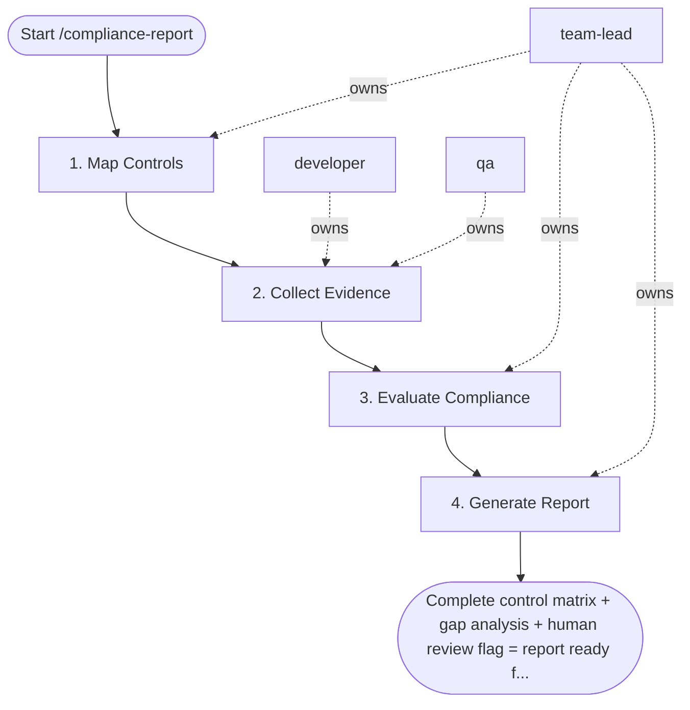

## Steps

### 1. Map Controls — `@team-lead`
- **Input:** compliance standard, period
- **Actions:** load control framework for requested standard; map each control to evidence sources (automated logs, documents, manual evidence)
- **Output:** control mapping table
- **Done when:** all controls mapped

### 2. Collect Evidence — `@developer` + `@qa`
- **Input:** control mapping
- **Actions:** automated evidence: CloudTrail, Vault audit logs, CI scan results; document evidence: `.security/` threat models, pentest reports; flag controls needing manual evidence (training records, access reviews)
- **Output:** evidence collection per control
- **Done when:** all controls have at least one evidence source or are flagged for manual collection

### 3. Evaluate Compliance — `@team-lead`
- **Input:** evidence collection
- **Actions:** assign status per control: Compliant / Partial / Non-Compliant / N/A; for Partial/Non-Compliant: document gap and remediation plan with timeline
- **Output:** evaluated control matrix
- **Done when:** all controls have status; all gaps have remediation plans

### 4. Generate Report — `@team-lead`
- **Input:** evaluated matrix
- **Actions:** produce executive summary: overall compliance %; control matrix: all controls with status and evidence links; gap analysis: non-compliant controls with risk and timeline; flag for human review before sharing externally; note: self-assessment aid, not certified audit
- **Output:** compliance report document
- **Done when:** report complete; human review flag set

## Agent Interaction Diagram

<!-- agent-diagram:start -->

<!-- agent-diagram:end -->

## Exit
Complete control matrix + gap analysis + human review flag = report ready for review.
