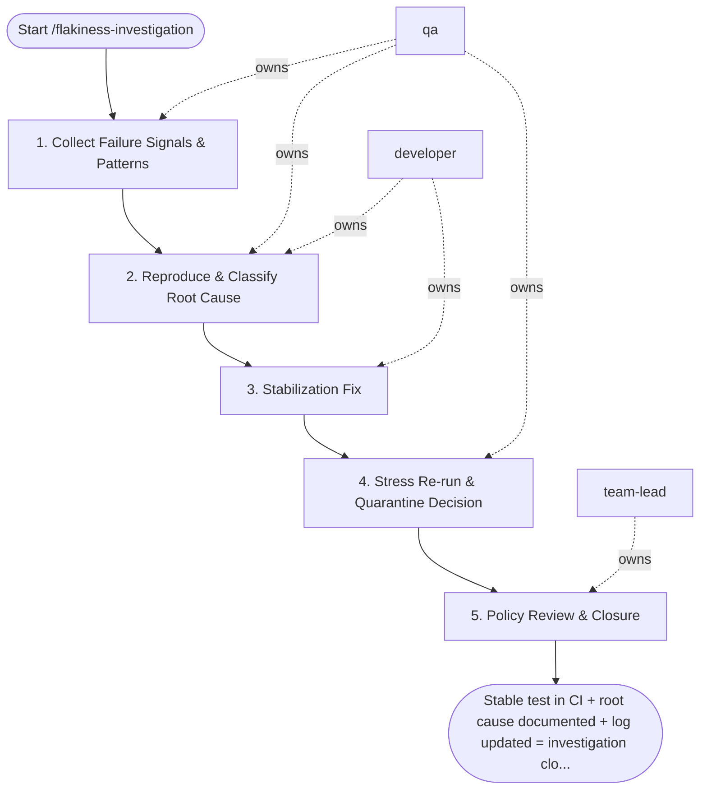

## Steps

### 1. Collect Failure Signals & Patterns — `@qa`
- **Input:** flaky test name, CI history
- **Actions:** pull last 20 CI runs; calculate flake rate; identify patterns: time-of-day, parallel vs. serial, specific test data, resource contention signals; quarantine the test immediately per flakiness policy
- **Output:** flake rate + pattern analysis; test quarantined
- **Done when:** flakiness pattern identified; test not blocking CI

### 2. Reproduce & Classify Root Cause — `@qa` + `@developer`
- **Input:** pattern analysis
- **Actions:** attempt local reproduction; classify root cause category: timing/race condition; test data pollution; external dependency non-determinism; test isolation failure; environment-specific (CI vs. local); `@developer` assists with code-level investigation
- **Output:** confirmed reproduction method; root cause category
- **Done when:** root cause category confirmed; can reproduce on demand

### 3. Stabilization Fix — `@developer`
- **Input:** confirmed root cause
- **Actions:** apply fix appropriate to root cause: add explicit waits/retries for timing; isolate test data per test; mock non-deterministic external deps; fix test setup/teardown isolation; implement fix as minimal change; do not just increase timeouts without addressing root cause
- **Output:** fix on feature branch
- **Done when:** fix addresses root cause, not just symptoms

### 4. Stress Re-run & Quarantine Decision — `@qa`
- **Input:** fix branch
- **Actions:** run fixed test 10+ times in CI; if stable: remove from quarantine; if still flaky: escalate with detailed root cause report for `@team-lead` decision (fix deeper vs. delete test)
- **Output:** stress run results; quarantine decision
- **Done when:** test stable for 5+ consecutive runs OR deletion decision made

### 5. Policy Review & Closure — `@team-lead`
- **Input:** stabilized test or escalation
- **Actions:** review fix quality; if test deleted: confirm equivalent coverage exists elsewhere; update flakiness tracking log; review if pattern reveals systemic issue requiring broader action
- **Output:** closure note in flakiness log; systemic action item if needed
- **Done when:** flakiness log updated; test unquarantined or deleted

## Agent Interaction Diagram

<!-- agent-diagram:start -->

<!-- agent-diagram:end -->

## Exit
Stable test in CI + root cause documented + log updated = investigation closed.
