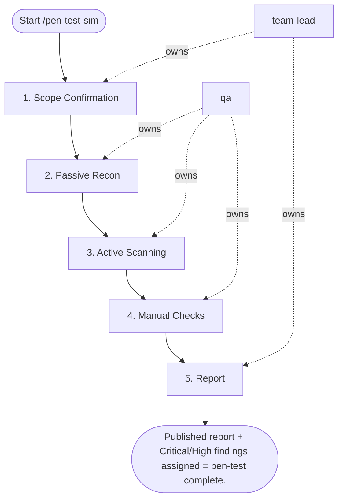

## Steps

### 1. Scope Confirmation — `@team-lead`
- **Input:** target URL
- **Actions:** verify target is staging/preview — NEVER production; log test start time for audit correlation; confirm scope (OWASP Top-10 or custom)
- **Output:** scope confirmation logged
- **Done when:** target and scope confirmed; never production

### 2. Passive Recon — `@qa`
- **Input:** confirmed target
- **Actions:** ZAP spider to discover all endpoints; identify technologies via response headers; check `robots.txt`, `sitemap.xml`
- **Output:** endpoint inventory; technology fingerprint
- **Done when:** full endpoint map produced

### 3. Active Scanning — `@qa`
- **Input:** endpoint inventory
- **Actions:** A01 Broken Access Control: IDOR on all object endpoints; A02 Crypto Failures: SSL config and header policies; A03 Injection: SQLi and XSS probes on all inputs; A05 Security Misconfiguration: headers, error responses; A07 Auth Failures: rate limiting, brute force protection
- **Output:** raw findings per OWASP category
- **Done when:** all in-scope categories evaluated

### 4. Manual Checks — `@qa`
- **Input:** active scan results
- **Actions:** auth token in URL parameters?; password reset: token expiry and single-use?; mass assignment on PUT/PATCH endpoints?
- **Output:** manual check results
- **Done when:** manual checks complete

### 5. Report — `@team-lead`
- **Input:** all findings
- **Actions:** produce OWASP-format finding report; include per finding: severity, evidence (request/response), remediation, CVSS score; assign remediation owners for Critical/High
- **Output:** `pentest_report_<date>.md`; remediation assignments
- **Done when:** report reviewed; remediation owners assigned

## Agent Interaction Diagram

<!-- agent-diagram:start -->

<!-- agent-diagram:end -->

## Exit
Published report + Critical/High findings assigned = pen-test complete.
