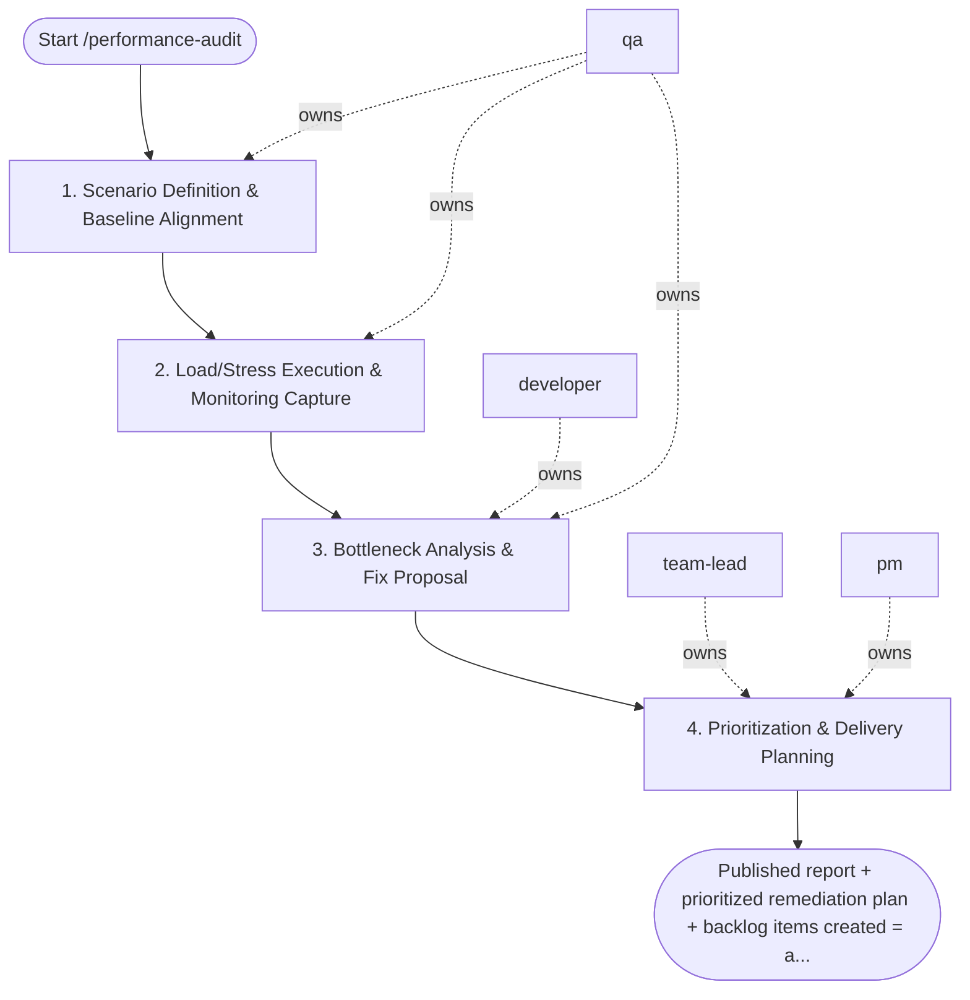

## Steps

### 1. Scenario Definition & Baseline Alignment — `@qa`
- **Input:** target, test type, SLO baseline
- **Actions:** define test scenarios (load / stress / soak / spike) matching production traffic patterns; confirm SLO baseline values (p50, p99 latency; error rate; throughput); align on success/failure thresholds with `@team-lead`
- **Output:** test plan with scenarios and thresholds
- **Done when:** `@team-lead` approves test plan

### 2. Load/Stress Execution & Monitoring Capture — `@qa`
- **Input:** approved test plan
- **Actions:** run load test; capture: latency percentiles (p50/p95/p99), error rate, throughput, saturation metrics (CPU, memory, DB connections); identify breaking point if stress test
- **Output:** raw performance metrics; test execution evidence
- **Done when:** all scenarios executed; metrics captured

### 3. Bottleneck Analysis & Fix Proposal — `@developer` + `@qa`
- **Input:** performance metrics
- **Actions:** identify bottleneck location: DB queries (EXPLAIN ANALYZE), service CPU, network, memory pressure; `@developer` proposes targeted fix per bottleneck; estimate improvement before implementing
- **Output:** bottleneck analysis with proposed fixes and estimates
- **Done when:** root cause per regression identified; fixes proposed

### 4. Prioritization & Delivery Planning — `@team-lead` + `@pm`
- **Input:** analysis with fix proposals
- **Actions:** prioritize fixes by SLO impact and effort; `@pm` schedules as engineering work items; produce `performance_report.md` with: scenario results vs. SLO, bottleneck analysis, remediation backlog with priority
- **Output:** `performance_report.md`; remediation backlog items created
- **Done when:** report complete; backlog items assigned

## Agent Interaction Diagram

<!-- agent-diagram:start -->

<!-- agent-diagram:end -->

## Exit
Published report + prioritized remediation plan + backlog items created = audit complete.
