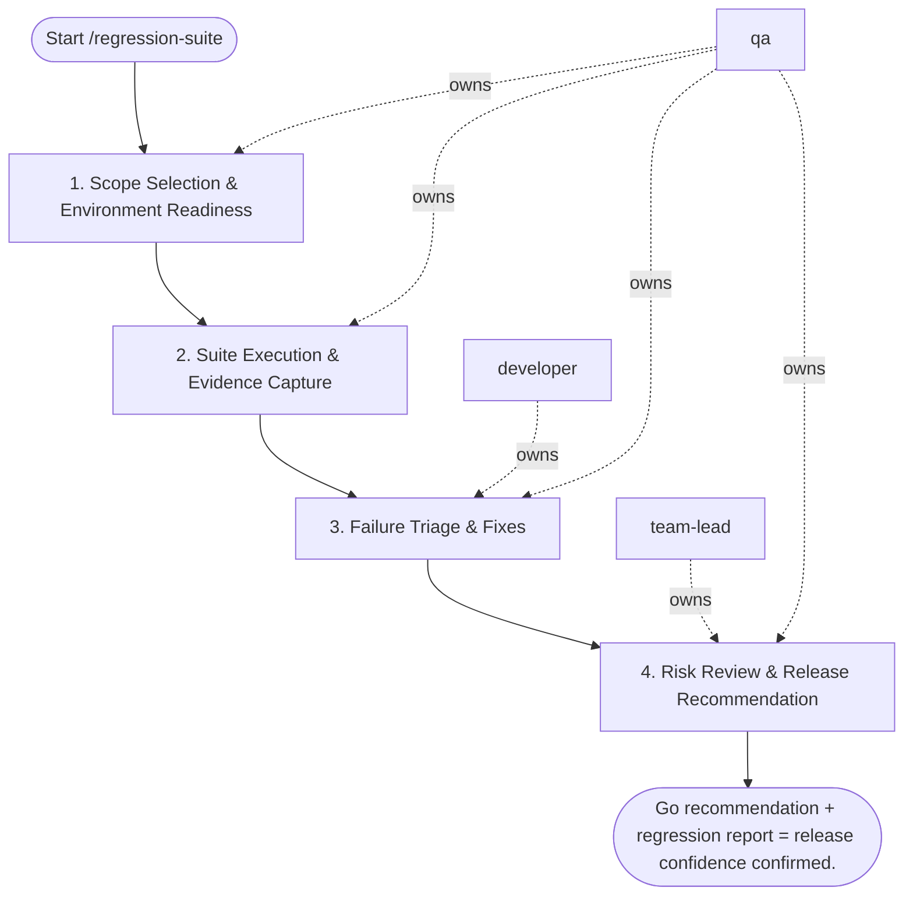

## Steps

### 1. Scope Selection & Environment Readiness — `@qa`
- **Input:** environment, regression scope
- **Actions:** confirm environment health (services up, test data seeded); select test scope based on change surface (smoke / targeted / full regression); ensure no flaky tests in scope without quarantine decision
- **Output:** confirmed scope + environment health check
- **Done when:** environment ready; scope documented

### 2. Suite Execution & Evidence Capture — `@qa`
- **Input:** ready environment + scope
- **Actions:** execute selected test suite; capture: pass/fail per scenario, logs, screenshots on failure, duration metrics
- **Output:** raw execution results
- **Done when:** full suite run complete; results captured

### 3. Failure Triage & Fixes — `@developer` + `@qa`
- **Input:** raw execution results
- **Actions:** `@qa` triages failures: real defect vs. flaky vs. environment issue; `@developer` fixes real defects; `@qa` applies flakiness policy for flaky tests (quarantine, not suppress); re-run after fixes
- **Output:** resolved defect list; updated execution results
- **Done when:** all failures triaged; real defects fixed or explicitly accepted with risk note

### 4. Risk Review & Release Recommendation — `@team-lead` + `@qa`
- **Input:** final execution results + defect list
- **Actions:** assess residual risk of accepted failures; produce `regression_report.md` with: pass rate, defect list with severity, risk assessment, explicit go/no-go recommendation
- **Output:** `regression_report.md`; go/no-go decision
- **Done when:** recommendation is explicit; stakeholders informed

## Agent Interaction Diagram

<!-- agent-diagram:start -->

<!-- agent-diagram:end -->

## Exit
Go recommendation + regression report = release confidence confirmed.
