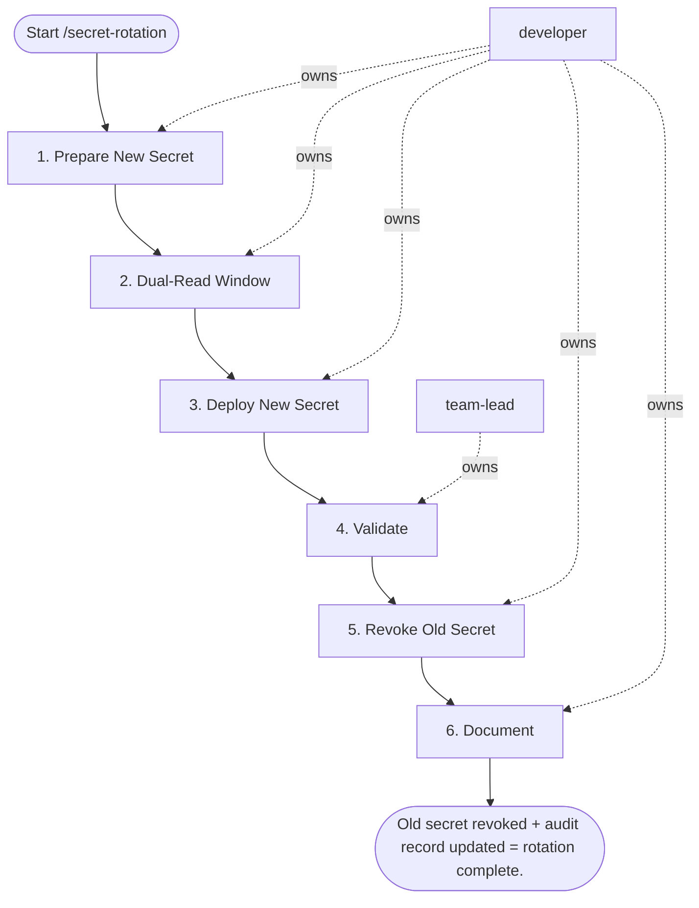

## Steps

### 1. Prepare New Secret — `@developer`
- **Input:** secret name
- **Actions:** generate new credential (strong, random); store in Secrets Manager as new version — old version stays active
- **Output:** new secret version created; old version still active
- **Done when:** both versions active in Secrets Manager

### 2. Dual-Read Window — `@developer`
- **Input:** new secret version
- **Actions:** update service to accept BOTH old and new credential; if single-credential only → schedule 2-minute maintenance window
- **Output:** service accepts both versions
- **Done when:** service deployed with dual-read capability

### 3. Deploy New Secret — `@developer`
- **Input:** dual-read service
- **Actions:** trigger rolling restart to pick up new version; monitor pod restarts and error rates for 5 minutes
- **Output:** all pods using new secret
- **Done when:** zero auth errors post-restart

### 4. Validate — `@team-lead`
- **Input:** deployed rotation
- **Actions:** confirm zero auth errors in monitoring; verify old credential is rejected by service
- **Output:** validation confirmation
- **Done when:** old credential confirmed rejected

### 5. Revoke Old Secret — `@developer`
- **Input:** validated rotation
- **Actions:** delete old version from Secrets Manager; confirm no reads on old version in audit log
- **Output:** old secret version deleted
- **Done when:** audit log confirms zero reads on old version

### 6. Document — `@developer`
- **Input:** completed rotation
- **Actions:** record in secret inventory: name, date, rotated by; set next rotation date (+90 days)
- **Output:** audit record updated
- **Done when:** inventory current; next rotation scheduled

## Agent Interaction Diagram

<!-- agent-diagram:start -->

<!-- agent-diagram:end -->

## Exit
Old secret revoked + audit record updated = rotation complete.
