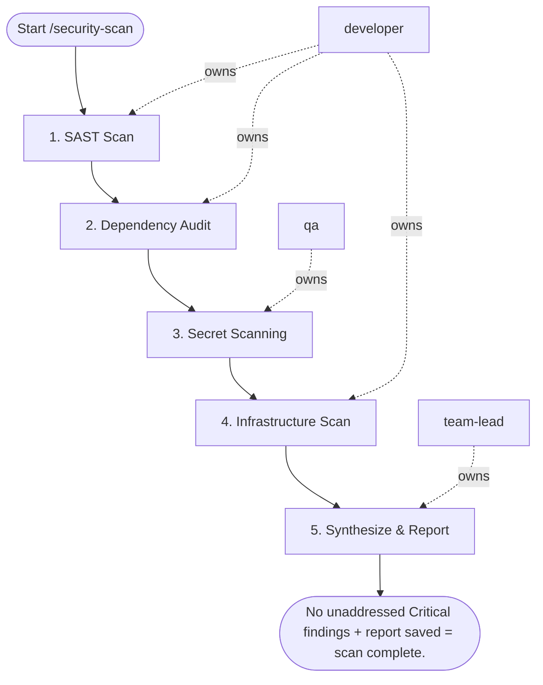

## Steps

### 1. SAST Scan — `@developer`
- **Input:** codebase
- **Actions:** `semgrep --config=p/security-audit`; `snyk code test`
- **Output:** SAST finding list
- **Done when:** scan complete; results saved

### 2. Dependency Audit — `@developer`
- **Input:** dependency files
- **Actions:** `npm audit --json` / `pip-audit` / `trivy fs`; cross-reference with OSV database; flag Critical (block) and High (plan) findings
- **Output:** dependency finding list with severity
- **Done when:** all deps scanned; Critical/High flagged

### 3. Secret Scanning — `@qa`
- **Input:** staged changes (PR mode) or full git log (full mode)
- **Actions:** `trufflehog filesystem` on staged changes; `gitleaks` on git log (last 100 commits if PR, full history if --full)
- **Output:** secret scan results
- **Done when:** no unreviewed secrets in scope

### 4. Infrastructure Scan — `@developer` (if IaC exists)
- **Input:** Terraform / K8s manifests
- **Actions:** `checkov -d terraform/`; `kube-score` on K8s manifests
- **Output:** IaC finding list
- **Done when:** all manifests scanned

### 5. Synthesize & Report — `@team-lead`
- **Input:** all scan results
- **Actions:** merge all findings; deduplicate by location; prioritize: Critical → High → Medium → Low; for Critical/High provide specific remediation code; post to PR as review comment; Critical → request changes (block merge); High → comment with 72-hour SLA; save full report: `.security/scan-results-<timestamp>.json`
- **Output:** `finding_report.md`; PR review comments
- **Done when:** report published; PR status set per findings

## Agent Interaction Diagram

<!-- agent-diagram:start -->

<!-- agent-diagram:end -->

## Exit
No unaddressed Critical findings + report saved = scan complete.
