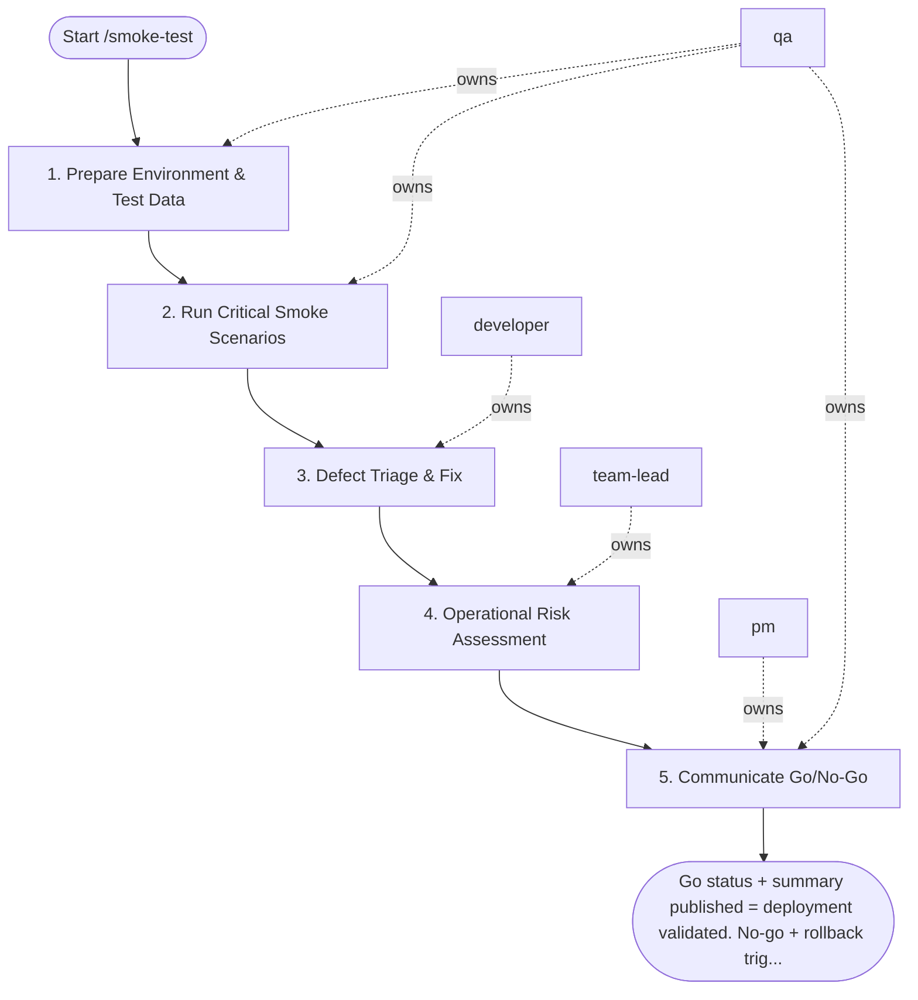

## Steps

### 1. Prepare Environment & Test Data — `@qa`
- **Input:** deployed environment
- **Actions:** confirm services responding; seed or verify required test data; confirm smoke suite targets correct environment (not staging vs. production mix)
- **Output:** environment ready; test data confirmed
- **Done when:** ready to execute in < 5 minutes of deployment

### 2. Run Critical Smoke Scenarios — `@qa`
- **Input:** ready environment
- **Actions:** execute smoke suite covering: authentication, core business action, key API endpoints, data read/write round-trip; capture evidence (response codes, screenshots, timing)
- **Output:** pass/fail per scenario; evidence captured
- **Done when:** all scenarios executed

### 3. Defect Triage & Fix — `@developer`
- **Input:** smoke failures (if any)
- **Actions:** `@qa` classifies failure: blocking (rollback) vs. non-blocking (monitor); if blocking → `@developer` assesses rollback vs. hotfix; if non-blocking → document and continue
- **Output:** triage decision per failure
- **Done when:** all failures triaged; rollback or hotfix decision made if needed

### 4. Operational Risk Assessment — `@team-lead`
- **Input:** triage results
- **Actions:** review blocking vs. non-blocking failure list; assess overall risk of keeping deployment live; confirm rollback decision if blocking failures present
- **Output:** risk assessment note
- **Done when:** go/no-go confirmed by `@team-lead`

### 5. Communicate Go/No-Go — `@pm` + `@qa`
- **Input:** risk assessment
- **Actions:** `@qa` produces `smoke_result_summary.md`; `@pm` communicates status to stakeholders; if rollback: trigger `/deploy-production` with previous version
- **Output:** `smoke_result_summary.md`; stakeholders informed
- **Done when:** all parties notified; action taken if needed

## Agent Interaction Diagram

<!-- agent-diagram:start -->

<!-- agent-diagram:end -->

## Exit
Go status + summary published = deployment validated. No-go + rollback triggered = incident response starts.
