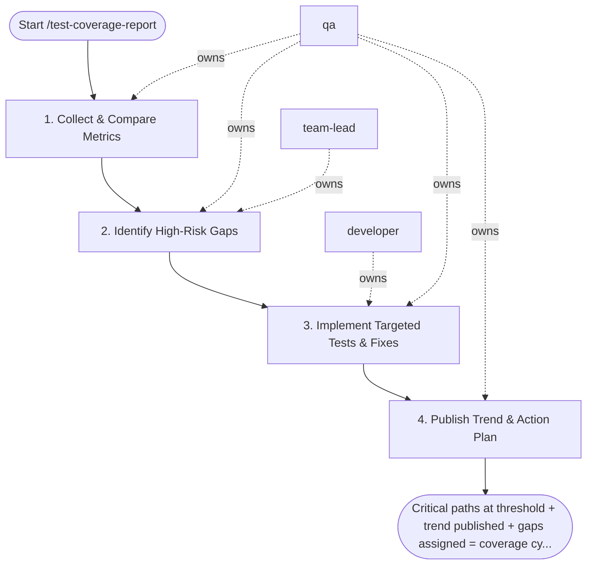

## Steps

### 1. Collect & Compare Metrics — `@qa`
- **Input:** coverage artifacts, threshold
- **Actions:** collect coverage report from CI (line, branch, function coverage); compare to previous sprint/release; identify regressions (coverage dropped) and improvements; segment by module/service for targeted analysis
- **Output:** coverage metrics with delta vs. previous; per-module breakdown
- **Done when:** metrics collected; delta computed

### 2. Identify High-Risk Gaps — `@qa` + `@team-lead`
- **Input:** per-module coverage breakdown
- **Actions:** map untested code to business criticality (payment flows > UI helpers); rank gaps by: data integrity risk, frequency of change, defect history; distinguish: "not worth testing" vs. "must cover"
- **Output:** prioritized gap list with risk classification
- **Done when:** gaps ranked; `@team-lead` agrees on priorities

### 3. Implement Targeted Tests & Fixes — `@developer` + `@qa`
- **Input:** prioritized gap list
- **Actions:** `@developer` fixes testability issues (DI, interfaces) if needed; `@qa` implements targeted tests for high-risk gaps; focus on behavior tests, not coverage inflation (no tests that only chase the number)
- **Output:** new tests on feature branch; coverage improved on critical paths
- **Done when:** critical paths meet threshold; no coverage-inflating tests added

### 4. Publish Trend & Action Plan — `@qa`
- **Input:** updated coverage metrics
- **Actions:** produce `coverage_report.md` with: coverage delta, module breakdown, newly covered critical paths, remaining known gaps with risk justification, trend chart (last 4 sprints if available)
- **Output:** `coverage_report.md`; next sprint coverage actions noted
- **Done when:** report shared with team; action items logged

## Agent Interaction Diagram

<!-- agent-diagram:start -->

<!-- agent-diagram:end -->

## Exit
Critical paths at threshold + trend published + gaps assigned = coverage cycle complete.
