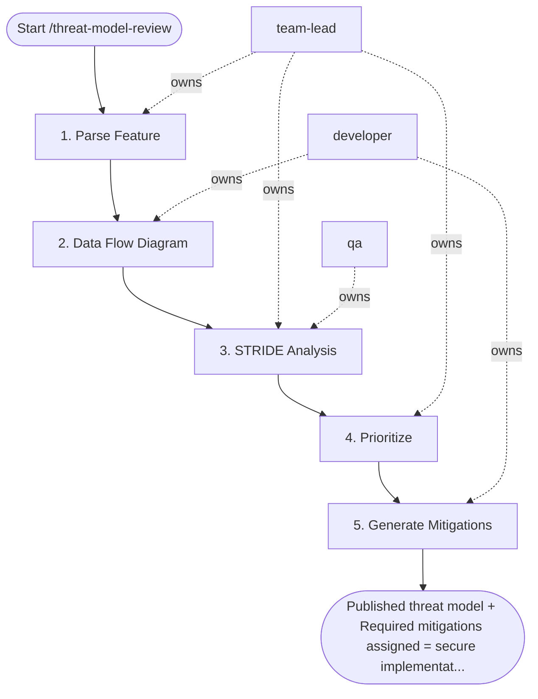

## Steps

### 1. Parse Feature — `@team-lead`
- **Input:** feature description
- **Actions:** extract: data processed, actors, trust boundaries crossed, entry points (APIs, file inputs, queues)
- **Output:** feature decomposition note
- **Done when:** trust boundaries explicitly identified

### 2. Data Flow Diagram — `@developer`
- **Input:** feature decomposition
- **Actions:** map: External Entities → Processes → Data Stores → Trust Boundaries
- **Output:** DFD (Mermaid or draw.io)
- **Done when:** all entry points visible in diagram

### 3. STRIDE Analysis — `@team-lead` + `@qa`
- **Input:** DFD
- **Actions:** for each trust boundary crossing, evaluate all 6 STRIDE categories (Spoofing / Tampering / Repudiation / Information Disclosure / Denial of Service / Elevation of Privilege); generate one finding per identified threat
- **Output:** STRIDE finding list
- **Done when:** all crossings evaluated; no category skipped

### 4. Prioritize — `@team-lead`
- **Input:** STRIDE findings
- **Actions:** score each: Likelihood (1–3) × Impact (1–3) = Risk Score; sort descending; classify: Required / Recommended / Accepted risk
- **Output:** prioritized risk register
- **Done when:** all findings classified

### 5. Generate Mitigations — `@developer`
- **Input:** prioritized risks
- **Actions:** map each Required threat to a control from `auth-patterns` or `crypto-standards` skills; document in threat model
- **Output:** `.security/threat-models/threat-model-<feature>.md` — DFD + STRIDE table + mitigations
- **Done when:** all Required findings have assigned controls; document complete

## Agent Interaction Diagram

<!-- agent-diagram:start -->

<!-- agent-diagram:end -->

## Exit
Published threat model + Required mitigations assigned = secure implementation can proceed.
